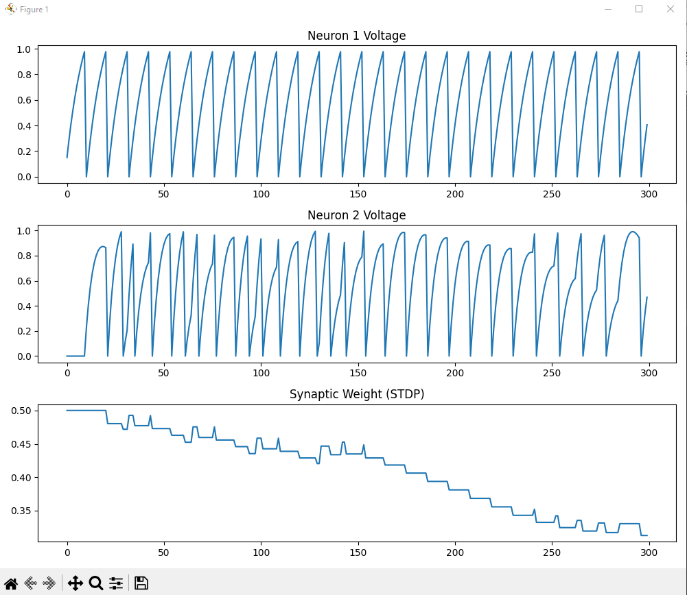

# 🧠 Spiking Neural Network with STDP

## Demo Output

This project implements a biologically inspired spiking neural network.

## Features

- Leaky Integrate-and-Fire (LIF) neurons
- Synaptic current with decay
- Hebbian learning
- Spike Timing Dependent Plasticity (STDP)
- Dynamic synaptic weight adaptation
- Voltage and weight visualization

## Run

Hebbian version:
python snn_hebbian.py

STDP version:
python snn_stdp.py

## Requirements

pip install numpy matplotlib
